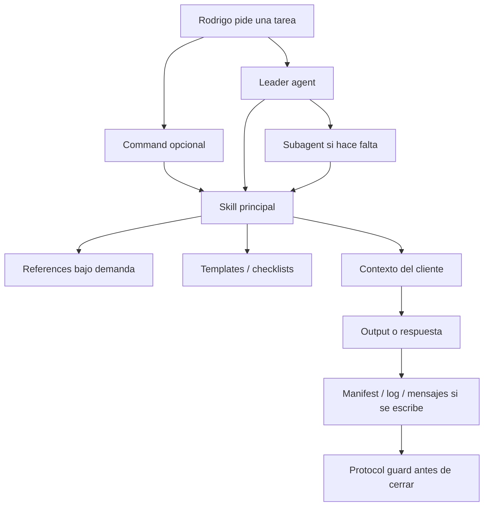

# Patron operativo de agentes v2

## Para que existe este documento

Define como debe funcionar E-SELEC v2 para no volver a mezclar prompts largos, memoria de clientes, canon, skills, commands y agentes.

La idea central: no copiar SEO tal cual a todas las areas. Copiar el patron.

## Mapa simple

## Responsabilidad de cada capa

| Capa | Que hace | Que no debe hacer |
|---|---|---|
| Command | Entrada rapida para Rodrigo, ejemplos, `--write`, lecturas y cierre | Repetir todo el procedimiento de la skill |
| Leader agent | Decide ruta, prioridad, riesgo y subagentes | Convertirse en manual largo de toda el area |
| Subagent | Mira una parte especializada del problema | Tocar produccion o escribir sin control |
| Skill | Procedimiento reutilizable, fuentes, workflow, bloqueos y salida | Guardar memoria de cliente o casos reales |
| References | Conocimiento largo bajo demanda | Cargarse siempre sin necesidad |
| Templates | Formato de salida | Decidir estrategia por si solos |
| Canon | Criterio transversal obligatorio del area | Existir solo porque hay mucha informacion |
| Clients | Memoria real, evidencia y outputs de clientes | Vivir dentro de skills generales |
| Planning/registries | Historia, decisiones y trazabilidad | Ser instrucciones operativas cargadas siempre |

## Cuando crear cada cosa

### Crear o reforzar una skill

Cuando falta procedimiento claro para ejecutar una tarea repetible:

- que leer;
- que comprobar;
- que bloquear;
- que entregar;
- que plantilla usar;
- que calidad minima exigir.

Ejemplo aplicado: `reports`.

### Crear un canon

Solo cuando hay criterio transversal que debe gobernar muchas tareas de un area.

Un canon se justifica si cumple al menos 3 condiciones:

- contiene juicio historico probado;
- evita errores repetidos;
- aplica antes de varias skills distintas;
- mejora calidad sin depender de un cliente real;
- define estandares de decision, no solo informacion.

Ejemplo aplicado: `seo-canon`.

Regla actualizada:

- Un canon nuevo debe cumplir la regla `.claude/rules/canon-admision.md`.
- Si no alcanza un nivel comparable al canon SEO, no se crea canon.
- En ese caso se refuerza una skill, referencia, checklist, template o planning note.
- No se crean canons por analogia ni por acumulacion de resumenes.

### Crear una referencia dentro de una skill

Cuando la skill ya existe, pero necesita conocimiento largo o reglas especificas que no deben cargarse siempre.

Ejemplo aplicado: `paid-ads/references/platform-rules.md`.

### Crear un command

Cuando Rodrigo necesita una forma facil de invocar un flujo.

Un command debe ser fino:

- leer la skill;
- leer contexto;
- responder en chat por defecto;
- escribir solo con `--write`;
- actualizar manifest/log si escribe;
- aplicar protocolos.

## Patron que funciono en SEO

SEO funciono bien por esta combinacion:

- canon fuerte;
- agentes ligeros;
- skills especializadas;
- casos reales fuera del canon;
- patrones anonimizados cuando un caso deja aprendizaje reutilizable;
- evidencia antes de conclusion.

Eso no significa que CRO, SEM, Reports, Web o Social necesiten canon ahora.

## Estado por area

| Area | Patron actual | Decision |
|---|---|---|
| SEO | Canon + skills + agentes | Mantener. No resumir canon. |
| Reports | Skill dedicada + templates | Mantener. No crear canon todavia. |
| SEM | Skill fuerte + referencias de riesgo | Mantener. No crear canon todavia. |
| CRO | Skills procedurales | Observar outputs antes de crear canon. |
| Web | Skills + protocolos de produccion | Revisar despues si necesita canon QA/prelaunch. |
| Social | Skills de contenido/copy | Observar outputs antes de crear canon. |

## Regla contra contaminacion

Los clientes reales viven en:

- `clients/[cliente]/`;
- `agency/` cuando sea memoria interna;
- `planning/` cuando sea historia de migracion;
- `registries/` cuando sea trazabilidad.

No deben vivir en:

- ejemplos reutilizables de commands;
- skills generales;
- canon general salvo como patron anonimizado;
- templates generales.

## Checklist antes de migrar o crear una pieza

- [ ] Esta pieza es general o de cliente?
- [ ] Si es de cliente, vive en `clients/[cliente]/`?
- [ ] Si es general, contiene nombres, URLs, cuentas o casos reales?
- [ ] Si es procedimiento, debe ser skill?
- [ ] Si es acceso rapido, debe ser command?
- [ ] Si es criterio transversal probado, merece canon?
- [ ] Si es largo pero no siempre necesario, debe ir a `references/`?
- [ ] Si se escribe archivo, queda registrado?
- [ ] Si hay riesgo, se aplican protocolos?

## Nota de ejecucion

Este documento no reemplaza a `AGENTS.md`, `CLAUDE.md`, skills ni protocolos. Es una guia de arquitectura para decidir donde vive cada cosa.
